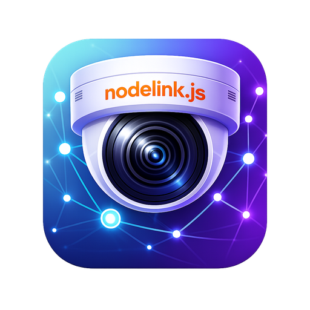

<table>
  <tr>
    <td></td>
    <td>
      <h1>nodelink.js</h1>
      <p>A TypeScript library for interacting with Reolink IP cameras and NVRs using the proprietary Baichuan protocol and CGI API.</p>
    </td>
  </tr>
</table>

## Credits

This library is inspired by and based on the reverse engineering work done by:

- **[neolink](https://github.com/thirtythreeforty/neolink)** - Rust implementation of Baichuan protocol
- **[reolink_aio](https://github.com/starkillerOG/reolink_aio)** - Python async library for Reolink cameras

## Features

- 🔌 **Baichuan Native Protocol** - Direct binary protocol for low-level camera control
- 🌐 **CGI HTTP API** - RESTful API for camera configuration and management
- 📺 **RTSP Server** - Stream camera feeds via standard RTSP protocol
- 📡 **RFC 4571 Server** - Low-latency TCP streaming for home automation integrations
- 🎤 **Two-way Audio (Intercom)** - Full duplex audio communication
- 📹 **Video Clips & Recordings** - Download and manage recorded footage
- 🔍 **Device Discovery** - Automatic camera detection via UDP broadcast
- 🎯 **PTZ Control** - Pan, Tilt, Zoom, and Preset management
- 🔔 **Motion & AI Events** - Real-time event notifications and subscriptions
- 📷 **Multifocal Support** - Composite streams for dual-lens cameras (TrackMix, Duo)

---

## 🖥️ Manager UI (Web Dashboard)

The library includes a **complete web-based management interface** for easy camera configuration and streaming control without writing code.

<p align="center">
  <b>Features:</b>
</p>

- 🎛️ **Camera Management** - Add, configure, and monitor multiple cameras
- 📹 **Live Streaming** - Preview streams via MJPEG, WebRTC, or RTSP
- 📊 **Real-time Logs** - Monitor camera events and system logs
- ⚙️ **Settings** - Configure RTSP proxy, ports, and auto-start options
- 📱 **PWA Support** - Install as a Progressive Web App on mobile devices
- 🌐 **Responsive Design** - Works on desktop, tablet, and mobile

### Quick Start (Development)

```bash
cd app
npm install
npm run dev
```

- Web UI: http://localhost:5173
- API Server: http://localhost:3000

### Production Build

```bash
cd app
npm run build
npm start
```

Open http://localhost:3000 in your browser.

### Docker Deployment (Recommended)

The easiest way to run the Manager UI is with Docker:

```bash
# Using pre-built image
docker pull ghcr.io/apocaliss92/nodelink-manager:latest

docker run -d \
  --name nodelink-manager \
  --network host \
  -v nodelink-data:/data \
  ghcr.io/apocaliss92/nodelink-manager:latest
```

Or with Docker Compose:

```bash
docker-compose up -d
```

**Environment Variables:**

| Variable          | Default | Description                          |
| ----------------- | ------- | ------------------------------------ |
| `PORT`            | `3000`  | HTTP server port                     |
| `RTSP_PROXY_PORT` | `8554`  | RTSP proxy port                      |
| `DATA_PATH`       | `/data` | Directory for settings.json and logs |

**Exposed Ports:**

| Port   | Description    |
| ------ | -------------- |
| `3000` | Web UI and API |
| `8554` | RTSP proxy     |

📖 **[Full Docker documentation →](./DOCKER.md)**

---

## 📚 Full API Documentation

For detailed method-by-method documentation, see the [documentation](./documentation/) folder:

### Baichuan Protocol API

| Section                                                    | Description                                     |
| ---------------------------------------------------------- | ----------------------------------------------- |
| [**Overview**](./documentation/baichuan-api/README.md)     | API overview and quick start                    |
| [Connection](./documentation/baichuan-api/connection.md)   | Login, logout, ping, reboot, dedicated sessions |
| [Device Info](./documentation/baichuan-api/device-info.md) | Device information, channels, capabilities      |
| [Streaming](./documentation/baichuan-api/streaming.md)     | Live video streams, codec configuration         |
| [Recordings](./documentation/baichuan-api/recordings.md)   | Search, download, replay recorded clips         |
| [PTZ Control](./documentation/baichuan-api/ptz.md)         | Pan, tilt, zoom, presets                        |
| [Events](./documentation/baichuan-api/events.md)           | Motion, AI, doorbell event subscriptions        |
| [Intercom](./documentation/baichuan-api/intercom.md)       | Two-way audio, talk sessions                    |
| [Snapshots](./documentation/baichuan-api/snapshots.md)     | Capture images, thumbnails                      |
| [Detection](./documentation/baichuan-api/detection.md)     | Motion, AI, PIR, autotracking settings          |
| [Lights](./documentation/baichuan-api/lights.md)           | Spotlight, floodlight, siren control            |
| [Battery](./documentation/baichuan-api/battery.md)         | Battery status, sleep/wake management           |
| [OSD](./documentation/baichuan-api/osd.md)                 | On-screen display configuration                 |
| [Network](./documentation/baichuan-api/network.md)         | Network, WiFi, storage, system settings         |

### CGI HTTP API

| Section                                                    | Description                         |
| ---------------------------------------------------------- | ----------------------------------- |
| [**CGI API Reference**](./documentation/cgi-api/README.md) | Complete HTTP/CGI API documentation |

### Additional Features

| Section                                           | Description                           |
| ------------------------------------------------- | ------------------------------------- |
| [Streaming Servers](./documentation/streaming.md) | RTSP, RFC4571, HTTP streaming servers |
| [Network Discovery](./documentation/discovery.md) | Automatic camera discovery via UDP    |

---

## Installation

```bash
npm install @apocaliss92/nodelink-js
```

## Quick Start

### Baichuan Native API

The Baichuan API provides direct access to camera functions through the proprietary binary protocol:

```typescript
import { ReolinkBaichuanApi } from "@apocaliss92/nodelink-js";

const api = new ReolinkBaichuanApi({
  host: "192.168.1.100",
  port: 9000, // Baichuan port
  username: "admin",
  password: "your-password",
});

await api.login();

// Get device info
const deviceInfo = await api.getDeviceInfo();
console.log("Camera:", deviceInfo.name, deviceInfo.model);

// Get stream info
const streamInfo = await api.getStreamInfoList();

// Subscribe to events
api.onMotionAlarm((event) => {
  console.log("Motion detected:", event);
});

await api.close();
```

📖 **[View full Baichuan API documentation →](./documentation/baichuan-api/README.md)**

### CGI HTTP API

The CGI API provides HTTP-based access for configuration and management:

```typescript
import { ReolinkCgiApi } from "@apocaliss92/nodelink-js";

const cgi = new ReolinkCgiApi({
  host: "192.168.1.100",
  port: 80, // HTTP port
  username: "admin",
  password: "your-password",
});

// Get device info
const info = await cgi.getDevInfo();

// Get recording files
const recordings = await cgi.searchRecordings({
  startTime: new Date("2024-01-01"),
  endTime: new Date("2024-01-02"),
  channel: 0,
});

// Get encoding settings
const enc = await cgi.getEnc(0);
```

📖 **[View full CGI API documentation →](./documentation/cgi-api/README.md)**

## Streaming

### RTSP Server

Create a local RTSP server that restreams camera feeds:

```typescript
import {
  BaichuanRtspServer,
  ReolinkBaichuanApi,
} from "@apocaliss92/nodelink-js";

const api = new ReolinkBaichuanApi({
  host: "192.168.1.100",
  port: 9000,
  username: "admin",
  password: "your-password",
});

const rtspServer = new BaichuanRtspServer({
  api,
  profile: "main", // main, sub, or ext
  channel: 0,
  port: 8554,
  logger: console,
});

await rtspServer.start();
// Stream available at rtsp://localhost:8554/stream
```

### RFC 4571 Server

Low-latency TCP streaming optimized for home automation systems like Scrypted:

```typescript
import {
  createRfc4571TcpServer,
  ReolinkBaichuanApi,
} from "@apocaliss92/nodelink-js";

const api = new ReolinkBaichuanApi({
  host: "192.168.1.100",
  port: 9000,
  username: "admin",
  password: "your-password",
});

const server = await createRfc4571TcpServer({
  api,
  profile: "main",
  channel: 0,
  host: "0.0.0.0",
  logger: console,
  username: "admin",
  password: "your-password",
});

// Connect your home automation system to the server
```

## Two-Way Audio (Intercom)

Send and receive audio for intercom functionality:

```typescript
import { ReolinkBaichuanApi } from "@apocaliss92/nodelink-js";

const api = new ReolinkBaichuanApi({
  host: "192.168.1.100",
  port: 9000,
  username: "admin",
  password: "your-password",
});

await api.login();

// Start talk session
await api.startTalk();

// Send audio data (raw PCM or G.711)
await api.sendTalkAudio(audioBuffer);

// Stop talk session
await api.stopTalk();
```

## Video Clips & Recordings

Download and manage recorded video clips:

```typescript
import { ReolinkBaichuanApi } from "@apocaliss92/nodelink-js";

const api = new ReolinkBaichuanApi({
  host: "192.168.1.100",
  port: 9000,
  username: "admin",
  password: "your-password",
});

await api.login();

// Search recordings by date
const recordings = await api.searchRecordings({
  channel: 0,
  startTime: new Date("2024-01-01"),
  endTime: new Date("2024-01-02"),
});

// Download a recording
const stream = await api.downloadRecording(recordings[0].filename);

// Pipe to file
import { createWriteStream } from "node:fs";
stream.pipe(createWriteStream("recording.mp4"));
```

## Device Discovery

Automatically discover cameras on your network:

```typescript
import { AutodiscoveryClient } from "@apocaliss92/nodelink-js";

const discovery = new AutodiscoveryClient();

discovery.on("device", (device) => {
  console.log("Found camera:", device.ip, device.name, device.uid);
});

await discovery.startDiscovery();

// Stop after 10 seconds
setTimeout(() => {
  discovery.stopDiscovery();
}, 10000);
```

## PTZ Control

Control Pan-Tilt-Zoom cameras:

```typescript
import { ReolinkBaichuanApi } from "@apocaliss92/nodelink-js";

const api = new ReolinkBaichuanApi({
  host: "192.168.1.100",
  port: 9000,
  username: "admin",
  password: "your-password",
});

await api.login();

// Move camera
await api.ptzControl({ channel: 0, command: "Right", speed: 32 });
await api.ptzControl({ channel: 0, command: "Stop" });

// Go to preset
await api.ptzGotoPreset({ channel: 0, preset: 1 });

// Get current position
const position = await api.getPtzPosition(0);

// Zoom control
await api.setZoomFocus({ channel: 0, zoom: { pos: 100 } });
```

## Events & Notifications

Subscribe to real-time camera events:

```typescript
import { ReolinkBaichuanApi } from "@apocaliss92/nodelink-js";

const api = new ReolinkBaichuanApi({
  host: "192.168.1.100",
  port: 9000,
  username: "admin",
  password: "your-password",
});

await api.login();

// Subscribe to motion events
api.onMotionAlarm((event) => {
  console.log("Motion:", event.state, "at channel", event.channel);
});

// Subscribe to AI events (person, vehicle, pet, etc.)
api.onAiAlarm((event) => {
  console.log("AI detection:", event.type, event.state);
});

// Subscribe to doorbell events
api.onVisitor((event) => {
  console.log("Visitor detected");
});
```

## NVR & Multi-Channel Support

Work with NVRs and their connected channels:

```typescript
import { ReolinkBaichuanApi } from "@apocaliss92/nodelink-js";

const api = new ReolinkBaichuanApi({
  host: "192.168.1.100",
  port: 9000,
  username: "admin",
  password: "your-password",
});

await api.login();

// Get all channels info
const channels = await api.getChannelInfoAll();

// Stream from a specific channel
const rtspServer = new BaichuanRtspServer({
  api,
  profile: "main",
  channel: 2, // Channel index
  port: 8554,
  logger: console,
});
```

## Configuration

### Environment Variables

Create a `.env` file based on `env.template`:

```env
CAMERA_HOST=192.168.1.100
CAMERA_PORT=9000
CAMERA_USERNAME=admin
CAMERA_PASSWORD=your-password
```

### Logging

The library supports custom loggers:

```typescript
import { ReolinkBaichuanApi, createLogger } from "@apocaliss92/nodelink-js";

const logger = createLogger({ level: "debug" });

const api = new ReolinkBaichuanApi({
  host: "192.168.1.100",
  port: 9000,
  username: "admin",
  password: "your-password",
  logger,
});
```

## CLI Tools

### RTSP Server

Run a standalone RTSP server:

```bash
npm run rtsp-server
```

Configure via environment variables:

- `CAMERA_HOST` - Camera IP address
- `CAMERA_PORT` - Baichuan port (default: 9000)
- `CAMERA_USERNAME` - Username
- `CAMERA_PASSWORD` - Password
- `RTSP_PORT` - RTSP server port (default: 8554)

## Supported Devices

This library has been tested with:

- Reolink IP cameras (RLC series, E1 series, Argus series)
- Reolink NVRs (RLN series)
- Reolink Home Hub
- Reolink TrackMix and Duo (multifocal cameras)
- Reolink battery cameras (Argus, TrackMix WiFi Battery)

## API Reference

📖 **Full API documentation available in the [documentation](./documentation/) folder.**

- [Baichuan Protocol API](./documentation/baichuan-api/README.md) - Binary protocol (port 9000)
- [CGI HTTP API](./documentation/cgi-api/README.md) - HTTP REST API (port 80)
- [Streaming Servers](./documentation/streaming.md) - RTSP, RFC4571, HTTP servers
- [Network Discovery](./documentation/discovery.md) - UDP autodiscovery

## Disclaimer

This project is **not affiliated with, endorsed by, or connected to Reolink** in any way.

"Reolink" is a trademark of Reolink Innovation Inc.

This is an independent, community-driven open-source project created for **interoperability purposes** — enabling users to integrate their own Reolink devices with third-party home automation systems and custom applications.

No proprietary code, firmware, or copyrighted materials from Reolink are included in this project. The protocol implementation is based on publicly available reverse engineering efforts from the community.
