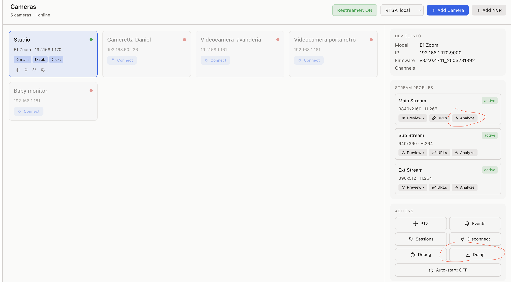

<p align="center">
  
  <br><br>
  A TypeScript library for interacting with Reolink IP cameras and NVRs using the proprietary Baichuan protocol and CGI API. Includes a full-featured web-based Manager UI.
</p>

## Components

### [Manager UI (Web Dashboard)](./app/README.md)

A complete web-based management interface for camera configuration and live streaming — no code required. Docker deployment, go2rtc restreamer, real-time events, MQTT, Home Assistant integration.

### [Library (`@apocaliss92/nodelink-js`)](./documentation/baichuan-api/README.md)

TypeScript library implementing the Reolink Baichuan binary protocol (port 9000) for direct camera/NVR communication. Streaming, events, PTZ, intercom, recordings, battery cameras, multifocal support.

```bash
npm install @apocaliss92/nodelink-js
```

```typescript
import { ReolinkBaichuanApi } from "@apocaliss92/nodelink-js";

const api = new ReolinkBaichuanApi({
  host: "192.168.1.100",
  port: 9000,
  username: "admin",
  password: "your-password",
});

await api.login();
const info = await api.getInfo();
await api.onSimpleEvent((event) => {
  console.log(event.type, "on channel", event.channel);
});
```

---

## Email Push for Battery Cameras

Battery cameras (Argus, Go, …) can't reliably keep a TCP/ONVIF push subscription alive while sleeping. The library ships an embedded SMTP intake (`createEmailPushServer`) so cameras can deliver motion alerts via e-mail — the most resilient path for sleep-heavy devices. Both the manager UI and the [Scrypted Reolink Native plugin](https://github.com/apocaliss92/scrypted-reolink-native) consume the same intake.

**Flow**:

1. Spin up the SMTP server. In the manager UI: **Settings → Email Push** (default port `2525`, random `nodelink-<hex>` + 18-byte base64url credentials auto-generated on first boot). Programmatic: `createEmailPushServer({ config, cameraResolver, logger })` from this package.
2. Each camera is reachable at `cam-<cameraId>@<domain>`. The intake matches the recipient local-part against the consumer's `cameraResolver` callback to decide which camera owns the message.
3. Configure the camera-side SMTP one of three ways:
   - **Auto** — manager: **Email Push** tab in the camera modal → *Auto-configure*. Scrypted: open the camera's Settings → **E-mail Push** group → *Auto-configure from Email Push Server*. Both call `setupEmailPushToManager` under the hood.
   - **API** — `await api.setupEmailPushToManager({ managerHost, managerPort, recipientLocalPart, domain, authUsername, authPassword, triggerTypes, attachmentType }, channel)`. The lib auto-wraps a bare username as `<user@domain>` so MAIL FROM stays RFC 5321 compliant.
   - **Manual** — fill the Reolink app form: server = manager LAN IP, port = `2525`, sender = `authUsername`, password = `authPassword`, TLS off, receiver = `cam-<id>@<domain>`.
4. On motion, the camera sends an e-mail. The intake parses it, classifies the trigger (`MD` / `people` / `vehicle`), and emits an `EmailPushEvent` on the shared bus. Snapshots are kept in memory only (no disk persistence) — they're forwarded to whatever per-event handler the consumer wires (MQTT image entities in the manager, `motionDetected` flip in the Scrypted plugin).

See [documentation/baichuan-api/email.md](./documentation/baichuan-api/email.md) for the full Baichuan API surface and [documentation/baichuan-api/time.md](./documentation/baichuan-api/time.md) for the related NTP / DST / system clock setters.

**Library entry points**:

- `createEmailPushServer({ config, cameraResolver, logger, loadTls? })` — factory returning `{ start, stop, restart, updateConfig, getStatus }`
- `subscribeEmailPushEvents({ cameraId? | match?, channel? })` on a `ReolinkBaichuanApi` instance — bridges per-camera SMTP events into the same `onSimpleEvent` stream native Baichuan push uses
- `getRecentEmailPushEvents(limit)` — bounded in-memory ring buffer of accepted deliveries
- `setupEmailPushToManager(params, channel)` — orchestrator: `setEmail` + `setEmailTask` + optional `testEmail`
- `getEmail`, `setEmail`, `testEmail`, `getEmailTask`, `setEmailTask` — low-level Baichuan accessors

**Key manager tRPC procedures**:

- `emailPush.status`, `emailPush.start/stop/restart`, `emailPush.updateSettings`
- `emailPush.getCameraAddress`, `emailPush.listCameraAddresses`
- `emailPush.recentEvents` (last 300, in-memory)
- `baichuan.setupEmailPushToManager`, `baichuan.getEmail/setEmail/testEmail`, `baichuan.getEmailTask/setEmailTask`

---

## Contributing: Share Your Camera Fixtures

Help improve device support by sharing the API responses from your camera model. The diagnostics dump captures all capability and configuration data (credentials, IPs, and serial numbers are **automatically sanitized**).

There are three ways to generate a dump:

**1. From the Manager UI** — Open a camera's detail panel and click the **"Dump"** button (next to Debug). The dump runs on the server and downloads a sanitized zip file automatically. Results are also available in the **Reports** section alongside stream analysis reports.

<p align="center">
  
</p>

**2. Via CLI script** — For developers with a local clone:

```bash
git clone https://github.com/apocaliss92/nodelink-js.git && cd nodelink-js && npm install
# Configure your camera in .env (see env.template)
npx tsx test/capture-model-fixtures.ts
```

**3. Via the library API** — From any project that depends on `@apocaliss92/nodelink-js`:

```typescript
import { ReolinkBaichuanApi, captureModelFixtures } from "@apocaliss92/nodelink-js";

const api = new ReolinkBaichuanApi({ host: "192.168.1.100", port: 9000, username: "admin", password: "your-password" });
await api.login();
await captureModelFixtures({ api, channel: 0, outDir: "./my-camera-dump", log: console.log });
await api.close();
```

Then open a PR with the generated fixtures. Each new camera model helps us detect capabilities more accurately and prevents regressions. If your model isn't listed in [Supported Devices](#supported-devices), your contribution is especially valuable.

---

## API Documentation

| Section | Description |
| --- | --- |
| [Baichuan Protocol API](./documentation/baichuan-api/README.md) | Binary protocol (port 9000) — streaming, events, PTZ, intercom, recordings |
| [CGI HTTP API](./documentation/cgi-api/README.md) | HTTP REST API (port 80) — configuration, settings, system administration |
| [Manager REST API](./documentation/manager-api.md) | Web dashboard HTTP API — auth, streaming, events, metrics |
| [Streaming Servers](./documentation/streaming.md) | RTSP, RFC4571, HTTP servers |
| [Network Discovery](./documentation/discovery.md) | UDP autodiscovery |

## Supported Devices

<!-- AUTO-UPDATED: regenerated from test/fixtures/models/ folders -->
<!-- To update: npx tsx test/capture-model-fixtures.ts then update this list -->

Devices with captured fixtures (verified API compatibility):

| Model | Type | Firmware |
| --- | --- | --- |
| E1 Outdoor PoE | Wired camera | v3.1.0.5223 |
| E1 Zoom | Wired camera (H.265, PTZ) | v3.2.0.4741 |
| RLC-810A | Wired camera (8MP) | v3.1.0.1162 |
| B400 | Wired camera (4MP) | v3.0.0.183 |
| Argus 3E | Battery camera (via Home Hub) | v3.0.0.3623 |
| Argus PT Ultra | Battery camera with PTZ (via Home Hub) | v3.0.0.3911 |
| Reolink Home Hub | NVR / Hub | v3.3.0.456 |

Also expected to work with other Reolink devices using the Baichuan protocol (port 9000): RLC series, RLN NVRs, TrackMix, Duo, and other Argus battery cameras.

## Credits

Based on the reverse engineering work of:

- **[neolink](https://github.com/thirtythreeforty/neolink)** - Rust implementation of Baichuan protocol
- **[reolink_aio](https://github.com/starkillerOG/reolink_aio)** - Python async library for Reolink cameras

## Disclaimer

This project is **not affiliated with, endorsed by, or connected to Reolink** in any way. "Reolink" is a trademark of Reolink Innovation Inc. This is an independent, community-driven open-source project created for **interoperability purposes**. No proprietary code or firmware from Reolink is included. The protocol implementation is based on publicly available reverse engineering efforts.
